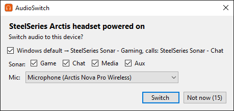
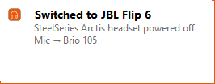
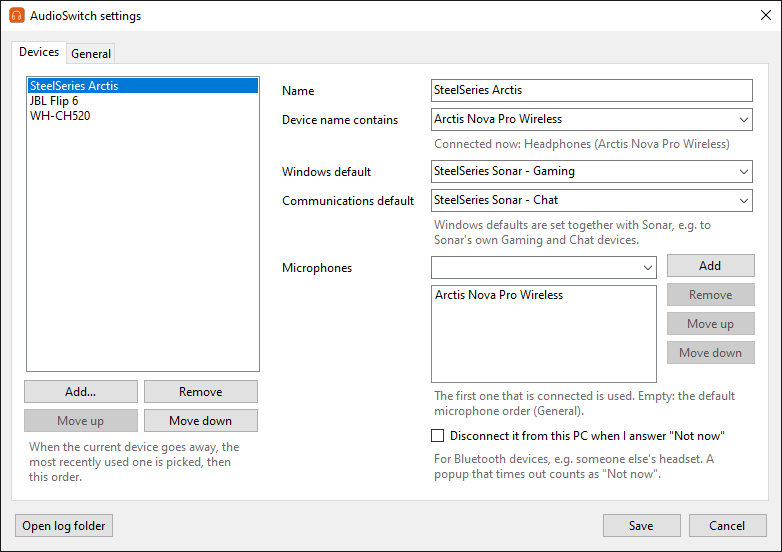
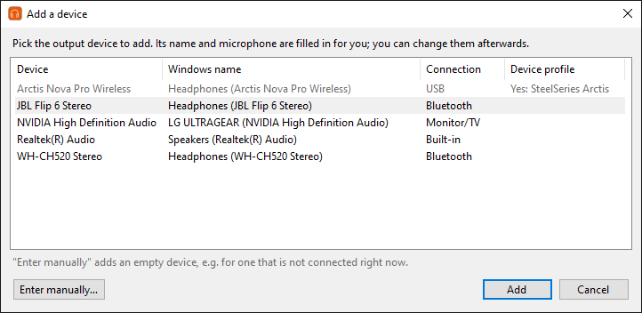
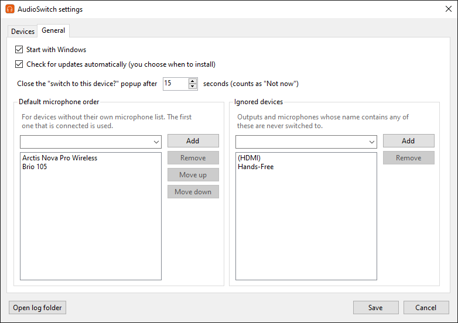
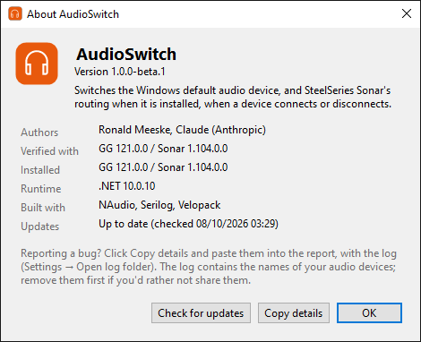

# AudioSwitch

**Automatic audio device switcher for Windows that keeps SteelSeries Sonar and the Windows default audio device in step.**

[](https://github.com/ronalddev-arch/AudioSwitch/releases/latest)
[](https://github.com/ronalddev-arch/AudioSwitch/releases)
[](LICENSE)
[](https://github.com/ronalddev-arch/AudioSwitch/releases/latest)

You connect your Bluetooth headphones, or turn off your Arctis headset, and **SteelSeries Sonar keeps playing to the old device**. To fix it you change the output twice: once in Windows sound settings and once in SteelSeries GG. AudioSwitch is a small tray app that does both for you, so Sonar doesn't get stuck on the old device when you switch to Bluetooth headphones or speakers. When a device connects, it asks whether to switch to it. When the device you're using disappears, it switches the Sonar output device and the Windows default automatically.

**Works without SteelSeries too.** If you don't use SteelSeries GG, AudioSwitch switches the Windows default playback and recording devices, with the same rules, on any Windows PC.

[](https://github.com/ronalddev-arch/AudioSwitch/releases/latest)

Windows 10 or 11, 64-bit. Free and open source. Get `AudioSwitch-win-Setup.exe` from the latest release.

## Contents
- [Features](#features)
- [Screenshots](#screenshots)
- [Installation](#installation)
- [How it works](#how-it-works)
- [Configuration](#configuration)
- [FAQ and troubleshooting](#faq-and-troubleshooting)
- [Building from source](#building-from-source) · [Contributing](#contributing) · [License](#license) · [Disclaimer](#disclaimer)

## Features
- **Popup when a device connects:** Bluetooth headphones, a speaker, or your SteelSeries headset turning on. Choose **Switch** or **Not now**. The popup closes by itself after 15 seconds (you can change this).
- **Automatic fallback:** when the device in use turns off or disconnects, AudioSwitch switches to the most recently used device that is still there, and shows a short notification.
- **Microphone rules per device:** for example the headset mic while the headset is on, otherwise your webcam mic.
- **Windows default and communications device per device:** for example Sonar's *Gaming* device as the Windows default and *Chat* for calls when you use your SteelSeries headset.
- **SteelSeries Sonar classic and stream mode.** In stream mode only your personal mix (what you hear) is switched, never the stream mix your audience hears (stream mode support is newer and less tested).
- **Windows-only mode:** without SteelSeries GG/Sonar it switches the Windows default playback and recording devices (newer and less tested).
- **Shared Bluetooth headphones:** a device can be disconnected from the PC when you answer "Not now", so it is free to connect to someone else's phone.
- **Never steals focus from games:** the popup and notifications appear in the corner without taking the keyboard or mouse.
- **Manual switching:** **Switch audio to** in the tray menu.
- **Settings window with a device picker:** pick a connected device and its name and microphone are filled in for you.
- **Update check:** notifies you of a new version. Nothing is installed until you click it.
- **No telemetry, no account.** The only internet connection is the update check against GitHub.

## Screenshots

<p>
  
  
</p>

*Left: the popup when a SteelSeries Arctis headset is turned on. Right: the notification after the headset was turned off and AudioSwitch fell back to a Bluetooth speaker.*



*Settings → Devices: one entry per device, in fallback order.*

<details>
<summary>More screenshots: device picker, General settings, About</summary>







</details>

## Installation
1. **Download** `AudioSwitch-win-Setup.exe` from the [latest release](https://github.com/ronalddev-arch/AudioSwitch/releases/latest).
2. **Run it.** It installs for your Windows user only, so it needs no administrator rights, and it includes everything it needs (no separate .NET download).
3. **"Windows protected your PC"?** Click **More info**, then **Run anyway**. Microsoft SmartScreen shows this for programs that aren't code-signed or haven't been downloaded by many people yet. AudioSwitch is an open-source project and its builds aren't signed (signing certificates cost money); you can read every line of the source here.
4. **First run:** AudioSwitch starts by itself and opens a short setup:
   - **Welcome:** tells you whether it found SteelSeries Sonar. If it did, it asks whether to keep sound going through SteelSeries Sonar (recommended).
   - **Monitor and TV speakers:** shown only if one is connected. Many monitors have no speakers, so the recommended answer is not to use them.
   - **Your devices:** tick the devices you listen on and put them in fallback order.
   - **Almost done:** **Start with Windows** and automatic update checks, both on by default.

   The setup doesn't change your sound; AudioSwitch acts the next time a device connects or turns off. **Cancel** keeps the defaults, and everything can be changed later in Settings.
5. **Find the tray icon:** an orange headphones icon next to the clock. If you don't see it, click the **^** arrow; you can drag the icon onto the taskbar to keep it visible. Right-click it for the menu. The Start menu also gets an **AudioSwitch** shortcut.

**Updating:** AudioSwitch checks for a new version a minute after it starts and then once a day. When there is one, a notification appears and the tray menu gets **Install update X.Y.Z (restarts)**. The update is installed only when you click it, so it never interrupts a game or a call; AudioSwitch then restarts. **About…** also has a **Check for updates** button. You can turn the automatic check off in Settings → General.

**Uninstall:** Windows Settings → Apps → AudioSwitch → Uninstall. Your settings and logs in `%AppData%\AudioSwitch` are kept; delete that folder if you don't want them.

## How it works
AudioSwitch watches Windows for audio devices that connect, disconnect, turn on or turn off.

- **A device connects** (or your SteelSeries headset turns on): a popup in the bottom-right corner asks **"Switch audio to this device?"**, pre-filled from your settings: the Windows default device, the Sonar channels and the microphone. Untick anything you want to keep where it is. There is no popup if audio already goes there, or for devices that were already connected when AudioSwitch started.
- **The device you're using goes away** (the headset is powered off, Bluetooth headphones are turned off or out of range): AudioSwitch switches to the best device that's left without asking. That is the most recently used one first, then the order in Settings. A notification tells you what happened. Ignored devices are never chosen, such as monitor or TV speakers if you said no to them in the setup.
- **At startup**, if audio is routed to a device that isn't there, AudioSwitch fixes it the same way.

### With SteelSeries GG and Sonar
- AudioSwitch changes Sonar's output devices through **Sonar's local API on your PC**, the same one the GG app uses. It is unofficial and undocumented, and **SteelSeries GG must keep running** (Sonar is part of it). AudioSwitch works alongside GG; it doesn't replace it.
- **Headset turned off or on:** Windows can't tell whether a wireless SteelSeries headset is powered on, because its USB base station stays connected. AudioSwitch asks Sonar, so turning the headset off or on works like unplugging or plugging in a device.
- **Classic mode:** the Game, Chat, Media and Aux channels are switched (the popup lets you pick). **Stream mode:** only the personal mix (what you hear) is switched; the stream mix is left alone. Stream mode support is newer and less tested than classic mode.
- **Verified with SteelSeries GG 120.0.0 / Sonar 1.103.0.0** and an **Arctis Nova Pro Wireless**, on Windows 10 22H2. Other SteelSeries wireless headsets should work the same way (headset detection isn't tied to one model), but haven't been tested.
- **After a GG update** the unofficial API could change. AudioSwitch shows a warning when the installed GG or Sonar version differs from the verified one; see [the FAQ](#gg-was-updated-and-switching-stopped-working).

### Without SteelSeries
If SteelSeries GG isn't installed, or Sonar is turned off in GG, AudioSwitch switches only the **Windows default playback device** (including the communications device) and the **Windows default recording device**. The tray tooltip then says "Windows only". If GG is installed but doesn't answer (for example while it starts after you sign in), AudioSwitch waits up to two minutes before it decides that Sonar isn't there. Windows-only mode is newer and less tested than switching with Sonar.

Each switching rule is pinned by a unit test in [`tests/AudioSwitch.Core.Tests`](tests/AudioSwitch.Core.Tests) (`RoutingEngineTests`, one scenario per rule).

## Configuration
Right-click the tray icon and choose **Settings…**. **Save** applies your changes right away.

**Devices tab:** one entry per output device. The order is the fallback order when the most recently used device isn't available.
- **Add…** lists the connected devices. Pick one and its name and microphone are filled in. **Enter manually…** adds a device that isn't connected right now.
- **Device name contains:** part of the device's Windows name, for example `Arctis Nova Pro Wireless`.
- **Windows default / Communications default:** the device itself, or another one, such as `SteelSeries Sonar - Gaming` and `SteelSeries Sonar - Chat` for a SteelSeries headset.
- **Microphones:** tried in order; the first one that is connected is used. Empty means the default order from the General tab.
- **Disconnect it from this PC when I answer "Not now":** for Bluetooth devices you share with someone else, such as headphones that are also used with another phone. A popup that times out counts as "Not now".

A device without an entry still works: you get the popup, and it becomes the Windows default itself.

**General tab:** start with Windows, automatic update checks, the popup timeout (5–300 seconds), the default microphone order, and ignored devices (for example monitor audio, and Bluetooth `Hands-Free` endpoints, which are ignored by default).

**Where things are stored:**
- Settings: `%AppData%\AudioSwitch\settings.json`. You can edit it by hand, but restart AudioSwitch afterwards (**Exit** in the tray menu, then start it from the Start menu).
- Logs: `%AppData%\AudioSwitch\logs\`, one file per day, kept for 14 days. **Open log folder** in Settings opens it.
- The app itself: `%LocalAppData%\AudioSwitch`.

## FAQ and troubleshooting

### Why doesn't SteelSeries Sonar switch to my Bluetooth headphones?
Sonar doesn't switch to Bluetooth headphones or speakers by itself. It sends each channel (Game, Chat, Media, Aux) to the output device chosen in SteelSeries GG, and it stays there when Bluetooth headphones or a Bluetooth speaker connect. Changing the Windows default audio device doesn't help either, because with Sonar the Windows default is one of Sonar's own virtual devices. So you have to change the output in GG as well. AudioSwitch does that for you: when the Bluetooth device connects, click **Switch** in the popup and both Sonar and Windows move to it.

### How do I make Sonar switch back to my Arctis headset when it turns on?
Install AudioSwitch and leave it running. When your Arctis headset is turned on, a popup asks whether to switch to it; click **Switch**. To get the Windows side right as well, add the headset in Settings → Devices with **Add…** and set its Windows defaults to `SteelSeries Sonar - Gaming` and `SteelSeries Sonar - Chat`.

### What happens when my headset is turned off?
If you were using it when it powered off, AudioSwitch switches Sonar and Windows to the most recently used device that is still connected (for example your Bluetooth speaker or your PC speakers), and moves the microphone according to your settings. A notification tells you what changed.

### Does AudioSwitch work without SteelSeries GG?
Yes. Without GG, or with Sonar turned off in GG, it switches the Windows default playback, communications and recording devices. That makes it a general automatic audio device switcher for Windows, for example for Bluetooth headphones and USB headsets.

### Does it work with Sonar stream mode?
Yes. In stream mode AudioSwitch switches your personal mix (what you hear) and the stream-mode microphone. It never changes the stream mix (what your audience hears). If you switch between classic and stream mode while AudioSwitch runs, it checks that the new mode plays to a device that is connected.

### Which SteelSeries headsets are supported?
It is verified with the **Arctis Nova Pro Wireless**. Other SteelSeries wireless headsets that Sonar reports as connected or disconnected should work too. Wired headsets and other brands work like any other device. If you try another model, please report whether it works in an [issue](https://github.com/ronalddev-arch/AudioSwitch/issues).

### GG was updated and switching stopped working
SteelSeries can change Sonar's local API in any GG update. AudioSwitch warns when the installed GG or Sonar version differs from the one it was verified with (**About…** shows both).
1. Check for an AudioSwitch update: **About… → Check for updates**.
2. If there is none, [report it](#how-do-i-report-a-bug).
3. Meanwhile, switch in SteelSeries GG yourself, or choose **Exit** in the tray menu.

### The popup doesn't appear when I connect a device
- The device might already be the one in use: there is no popup when nothing would change.
- It might be ignored (Settings → General → Ignored devices), such as monitor audio.
- With SteelSeries GG installed, there is no popup while GG/Sonar isn't reachable (grey tray icon), for example just after you sign in.
- The log gives the reason for every device; see below.

### Is it safe? Does it send data anywhere?
AudioSwitch has no telemetry and no account. The only internet connection is the update check, which asks GitHub for the latest release of this repository (a minute after start and then daily; you can turn it off). It talks to Sonar only on your own PC (`127.0.0.1`), and it needs no administrator rights. The logs stay on your PC unless you attach one to a bug report (see below).

### Where are the logs?
In `%AppData%\AudioSwitch\logs\`, one file per day (`audioswitch-YYYYMMDD.log`). Every switch, popup and skipped device is logged with the reason. Settings → **Open log folder** opens the folder.

### How do I report a bug?
[Open an issue](https://github.com/ronalddev-arch/AudioSwitch/issues) and describe what you did and what happened.
- Open **About…** from the tray icon, click **Copy details** (AudioSwitch, GG/Sonar and Windows versions) and paste that into the issue.
- The log usually shows what went wrong: Settings → **Open log folder**, the file for the day it happened.
- **The logs contain the names of your audio devices** (for example your headset or speaker model). Remove them before you attach a log if you'd rather not share them.

### Can I switch manually?
Yes: right-click the tray icon → **Switch audio to** → pick a device.

## Building from source
You need Windows and the .NET 10 SDK:
```powershell
dotnet build AudioSwitch.slnx
dotnet test tests/AudioSwitch.Core.Tests
```
See [CONTRIBUTING.md](CONTRIBUTING.md) for running your own build, the code layout and how releases are made.

## Contributing
Bug reports, tested devices and pull requests are welcome. Please read [CONTRIBUTING.md](CONTRIBUTING.md) first. Before a pull request can be merged, contributors sign the [Contributor License Agreement](CLA.md) once, by commenting on their first pull request.

## License
AudioSwitch is licensed under the [Apache License 2.0](LICENSE). Third-party components and their licenses are listed in [NOTICE](NOTICE).

## Disclaimer
AudioSwitch is an independent project. It is not affiliated with, endorsed by or supported by SteelSeries. SteelSeries, SteelSeries GG, Sonar and Arctis are trademarks of their respective owners. AudioSwitch uses Sonar's unofficial local API, which can change with any GG update.
